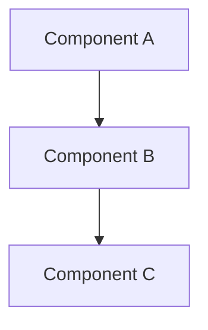

# {Project/Feature Name}

## 功能概述 (Functionality Overview)

### 核心功能 (Core Features)
<!-- 简要说明该代码实现的主要功能 -->

### 应用场景 (Use Cases)
<!-- 说明该代码适用的具体场景和问题 -->

### 设计目标 (Design Goals)
<!-- 阐述代码设计时的主要考虑和目标 -->

---

## 技术架构 (Technical Architecture)

### 整体架构 (Overall Structure)
<!-- 描述代码的整体架构设计
可以使用 mermaid 图来可视化架构

-->

### 技术栈 (Technology Stack)
<!-- 列出使用的主要技术、框架和库 -->
- **Language**: 
- **Framework**: 
- **Dependencies**: 

### 数据流 (Data Flow)
<!-- 描述数据在系统中的流动方式 -->

---

## 关键组件说明 (Key Components)

### 组件/模块 1 (Component/Module 1)
**文件**: [{filename}](file:///path/to/file)

**功能**: 
<!-- 详细说明该组件的功能 -->

**核心方法/函数**:
<!-- 列出关键的方法或函数及其作用 -->

**使用示例**:
```python
# Example code here
```

### 组件/模块 2 (Component/Module 2)
<!-- 重复上述结构 -->

---

## 技术难点分析 (Technical Challenges)

### 难点 1: {Problem Description}

**问题描述**:
<!-- 详细描述遇到的技术挑战 -->

**解决方案**:
<!-- 说明采用的解决方案及其原理 -->

**关键代码**:
<!-- 链接到相关代码位置 -->
[{function_name}](file:///path/to/file#L{start}-L{end})

**为什么这样设计**:
<!-- 解释设计决策的考虑因素 -->

### 难点 2: {Problem Description}
<!-- 重复上述结构 -->

---

## 使用示例 (Usage Examples)

### 基础用法 (Basic Usage)
```python
# 展示最基本的使用方式
```

### 高级用法 (Advanced Usage)
```python
# 展示更复杂的使用场景
```

### 常见场景 (Common Scenarios)
#### 场景 1: {Scenario Name}
```python
# 具体示例代码
```

#### 场景 2: {Scenario Name}
```python
# 具体示例代码
```

---

## 维护注意事项 (Maintenance Guidelines)

### 代码规范 (Code Standards)
<!-- 说明代码遵循的规范和约定 -->

### 扩展指南 (Extension Guide)
<!-- 如何安全地扩展或修改代码 -->
- 添加新功能时需要注意: 
- 修改现有功能时需要注意: 

### 已知限制 (Known Limitations)
<!-- 列出当前实现的局限性 -->

### 性能考虑 (Performance Considerations)
<!-- 说明性能相关的注意事项 -->

### 调试技巧 (Debugging Tips)
<!-- 提供常见问题的调试方法 -->

---

## 测试说明 (Testing)

### 测试覆盖 (Test Coverage)
<!-- 说明测试覆盖情况 -->

### 运行测试 (Running Tests)
```bash
# 测试命令
```

### 测试场景 (Test Scenarios)
<!-- 列出主要的测试场景 -->

---

## 依赖关系 (Dependencies)

### 外部依赖 (External Dependencies)
<!-- 列出项目依赖的外部库和服务 -->

### 内部依赖 (Internal Dependencies)
<!-- 说明与其他模块的依赖关系 -->

---

## 更新日志 (Changelog)

### {Date} - Initial Implementation
- 实现的主要功能
- 关键设计决策

---

## 参考资料 (References)
<!-- 列出相关的文档、文章或资源 -->
