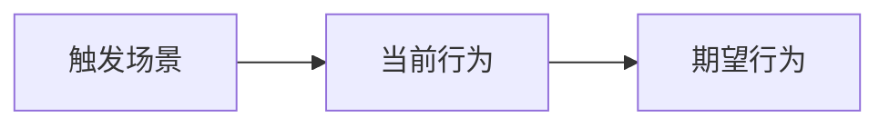

# 背景
[用 2-4 句话描述当前问题、触发原因和用户痛点。]

# 目标
- [本次必须完成的结果]

# 非目标
- [明确这次不处理的内容]

# 用户流程

# 改动点
- [改动点 1]
- [改动点 2]

# 涉及文件
| 状态 | 文件 | 计划修改 |
| --- | --- | --- |
| confirmed | `path/to/file` | [修改原因] |
| suspected | `path/to/other-file` | [待确认原因] |

# 技术方案 / 依赖
- [涉及的 API、组件、工具或新增依赖]
- [若无新增依赖，明确写“无”]

# 结构约束
- 保持现有目录结构不扩散。
- 不新增不必要的公共抽象。
- 遵循当前页面或组件的既有模式。

# 影响范围评估
- UI: [无 / 轻微 / 中等]
- 状态或数据: [无 / 轻微 / 中等]
- 接口契约: [无 / 轻微 / 中等]
- 公共组件: [无 / 轻微 / 中等]
- 测试或文档: [需要 / 不需要]

# 验收标准
- [ ] [可直接验证的结果]

# 风险与回滚
- 风险: [主要风险]
- 回滚: [如何撤回本次改动]

# 待确认问题 / 假设
- [如暂无，写“无”]

# Implementation Result
- [开发完成后补充]

# Actual Changed Files
- [开发完成后补充]

# Deviation From Plan
- [开发完成后补充；如无，写“无”]

# Verification
- [开发完成后补充]
