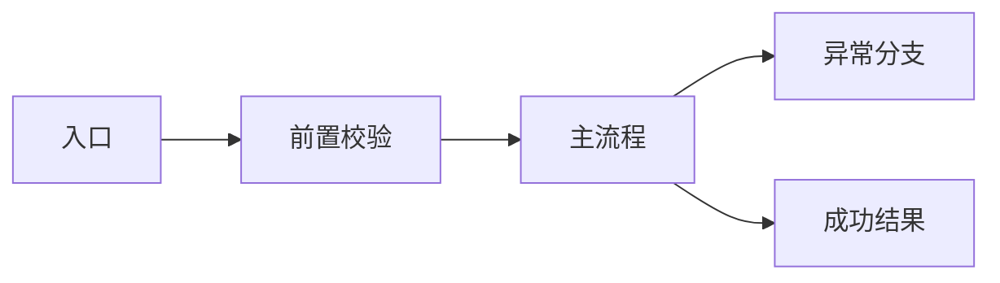

# 背景
[说明业务背景、历史上下文、当前痛点和触发原因。]

# 目标
- [核心目标 1]
- [核心目标 2]
- [核心目标 3]

# 非目标
- [明确不在本次交付范围内的内容]

# 相关方
- 产品: [负责人]
- 前端: [负责人]
- 后端 / 云函数: [负责人]
- 测试 / 验收: [负责人]

# 端到端流程

# 拟议方案
- [方案概述]
- [为何采用该方案]
- [备选方案及放弃原因]

# 模块拆分与改动点
- [子模块 1]
- [子模块 2]
- [子模块 3]

# 涉及文件
| 状态 | 层级 | 文件 | 计划修改 |
| --- | --- | --- | --- |
| confirmed | page | `path/to/file` | [修改原因] |
| confirmed | component | `path/to/component` | [修改原因] |
| confirmed | service | `path/to/service` | [修改原因] |
| suspected | config | `path/to/config` | [待确认原因] |

# 技术栈 / 依赖 / 新增内容
- [新增依赖或版本升级]
- [新增组件、工具、状态模块或脚手架]
- [兼容性或平台差异处理]

# 目录与结构约束
- [本次允许新增的目录]
- [必须复用的现有模块]
- [禁止打破的边界]

# 数据 / 接口 / 契约变化
- 数据结构: [说明]
- 接口请求: [说明]
- 接口响应: [说明]
- 本地存储 / 缓存: [说明]
- 云函数 / 服务端: [说明]

# 影响范围评估
- UI 页面: [列出受影响页面]
- 公共组件: [列出受影响组件]
- 共享状态: [列出 store / context]
- 权限 / 登录 / 支付: [列出敏感流程]
- 埋点 / 监控 / 日志: [列出受影响项]
- 构建 / 配置 / 环境变量: [列出受影响项]
- 测试与发布: [说明需要补充的验证]

# 实施阶段
- 阶段 1: [目标]
- 阶段 2: [目标]
- 阶段 3: [目标]

# 验收标准
- [ ] [验收项 1]
- [ ] [验收项 2]
- [ ] [验收项 3]

# 风险 / 回滚 / 观察项
- 风险: [高风险点 1]
- 风险: [高风险点 2]
- 回滚: [回滚步骤]
- 观察项: [上线后需要重点观察的数据或日志]

# 待确认问题 / 假设
- [待确认项 1]
- [待确认项 2]
- [假设项 1]

# Human Review Sign-off
- [ ] 方案已审阅
- [ ] 范围已确认
- [ ] 风险已确认
- [ ] 允许进入开发

# Implementation Result
- [开发完成后补充]

# Actual Changed Files
- [开发完成后补充]

# Deviation From Plan
- [开发完成后补充；如无，写“无”]

# Verification
- [开发完成后补充]
