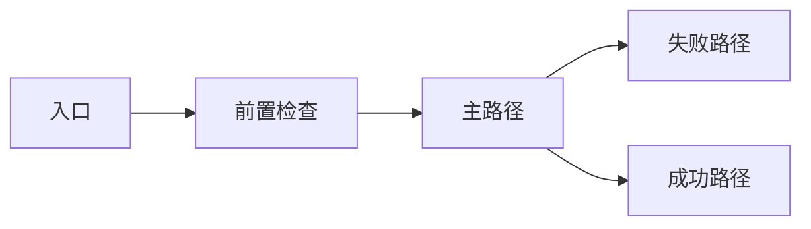

# 背景
[说明业务背景、历史背景、当前问题，以及为何该变更为高风险。]

# 目标
- [目标 1]
- [目标 2]
- [目标 3]

# 非目标
- [明确本阶段不做什么。]

# 相关方
- Product: [负责人]
- Engineering: [负责人]
- Backend / Platform: [负责人]
- QA / Acceptance: [负责人]

# 端到端流程

# 方案
- [概述选定方案]
- [说明为何选择该方案]
- [列出主要备选方案及未采用原因]

# 变更计划
- [工作流 1]
- [工作流 2]
- [工作流 3]

# 文件计划
| 状态 | 层级 | 文件 | 计划变更 |
| --- | --- | --- | --- |
| confirmed | view | `path/to/view` | [说明该文件为何需要修改] |
| confirmed | state | `path/to/store` | [说明该文件为何需要修改] |
| confirmed | service | `path/to/service` | [说明该文件为何需要修改] |
| suspected | backend | `path/to/backend` | [说明为何可能需要修改] |

# 数据 / 契约 / 发布影响
- Persisted data: [描述 schema 或迁移影响]
- API contract: [描述请求/响应影响]
- Feature flags / rollout: [描述分阶段发布需求]
- Backward compatibility: [描述必须保持兼容的部分]

# 约束
- [架构或目录约束]
- [必须复用的模块]
- [不得破坏的模块或契约]

# 验证计划
| 类型 | 步骤 | 预期结果 |
| --- | --- | --- |
| command | `[command]` | [应通过的检查] |
| command | `[command]` | [应通过的检查] |
| manual | [手工验证路径] | [可见结果] |
| rollout | [上线后观察的指标/日志/监控] | [健康信号] |

# 分阶段计划
- Phase 1: [目标]
- Phase 2: [目标]
- Phase 3: [目标]

# 风险 / 回滚 / 可观测性
- Risk: [高风险项 1]
- Risk: [高风险项 2]
- Rollback: [回滚步骤]
- Observability: [发布后观察项]

# 未决问题 / 假设
- [未决问题 1]
- [未决问题 2]
- [假设 1]

# 人工评审签署
- [ ] 范围已批准
- [ ] 风险已接受
- [ ] 发布与回滚方案已批准
- [ ] 用户已明确确认，允许开始实现

# 实施结果
- [实现后填写。]

# 实际变更文件
| 文件 | 实际变更 |
| --- | --- |
| `path/to/file` | [实现后填写。] |

# 偏离计划说明
- [若与计划一致，写“None”。]

# 验证结果
- [列出实际执行过的命令、手工验证和上线观察结果。]
